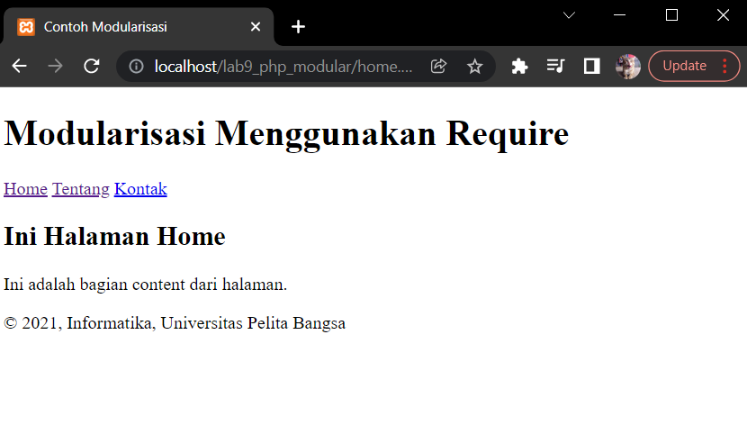
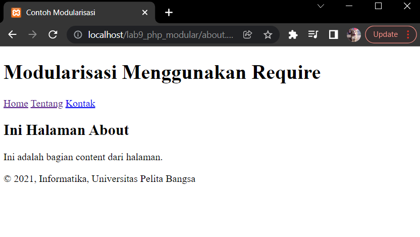

# :rocket: Latihan membuat program secara modular di PHP

Made With : [](https://www.google.com/intl/id_id/chrome/) [](https://code.visualstudio.com/) [](https://www.php.net/)

- Nama : Hizbullah Ridwan
- NIM : 312110055
- Kelas : TI.21.B.1
- Mata Kuliah : Pemrograman Web

Daftar isi :

- [Create Home Page](https://github.com/Ridwanwildan/Lab9Web#create-home-page)
- [Create About Page](https://github.com/Ridwanwildan/Lab9Web#create-about-page)
- [Create Modular File](https://github.com/Ridwanwildan/Lab9Web#create-modular-file)

Latihan membuat program modular kali ini, yang akan dibuat adalah sebuah website dengan tampilan sederhana. Didalamnya terdapat dua tampilan yaitu home dan about. Pada home dan about, masing-masing punya header dan footer yang terpisah dan akan digabungkan. Hasilnya nanti akan seperti ini :





## Create Home Page

Pertama adalah membuat file homepage dengan nama `home.php` seperti ini :

```bash
<?php require('header.php'); ?>
<div class="content">
    <h2>Ini Halaman Home</h2>
    <p>Ini adalah bagian content dari halaman.</p>
</div>
<?php require('footer.php'); ?>
```

Pada `home.php` tidak ada header dan footernya, maka perlu ditambahkan `<?php require(); ?>` supaya bisa header dan footer bisa terhubung ke `home.php`.

## Create About Page

Selanjutnya adalah membuat tampilan kedua yaitu about page. Beri nama `about.php` dengan isi seperti ini :

```bash
<?php require('header.php'); ?>
    <div class="content">
        <h2>Ini Halaman About</h2>
        <p>Ini adalah bagian content dari halaman.</p>
    </div>
<?php require('footer.php'); ?>
```

Sama seperti home page, about page juga tidak ada header dan footernya, dan perlu ditambahkan `<?php require(); ?>` supaya bisa header dan footer bisa terhubung.

## Create Modular File

Terakhir adalah membuat file modularnya. Yaitu `header.php` untuk file header dan `footer.php` untuk file footer.

### Header

Tambahkan isinya seperti ini :

```bash
<!DOCTYPE html>
<html lang="en">
    <head>
        <meta charset="UTF-8">
        <title>Contoh Modularisasi</title>
        <link href="style.css" rel="stylesheet" type="text/stylesheet"
        media="screen" />
    </head>
    <body>
        <div class="container">
        <header>
            <h1>Modularisasi Menggunakan Require</h1>
        </header>
        <nav>
            <a href="home.php">Home</a>
            <a href="about.php">Tentang</a>
            <a href="kontak.php">Kontak</a>
        </nav>
```

### Footer

Tambahkan isinya seperti ini :

```bash
            <footer>
                <p>&copy; 2021, Informatika, Universitas Pelita Bangsa</p>
            </footer>
        </div>
    </body>
</html>
```
